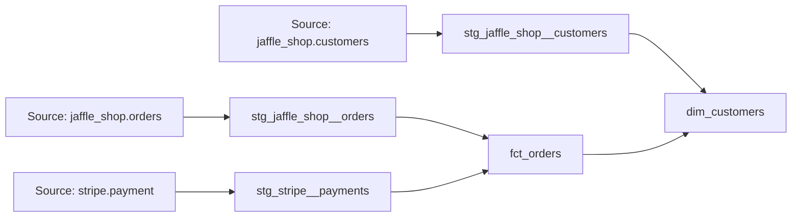

# Jaffle Shop — dbt Fundamentals Project


A dbt project that transforms raw customer, order, and payment data into analytics-ready models using SQL, BigQuery, and dbt.

## About this project

This repository contains the project I developed while completing the **dbt Fundamentals course by dbt Labs**.

The project uses the fictional Jaffle Shop dataset provided during the course. Its purpose is to practice the main concepts involved in building a dbt project, including:

- declaring and documenting data sources;
- creating staging and mart models;
- using `source()` and `ref()` to define dependencies;
- implementing data quality tests;
- configuring source freshness;
- generating dbt documentation;
- organizing transformations into reusable data models.

The repository reflects my hands-on implementation during the course and was published as part of my studies in analytics engineering and data engineering.

## Project overview

The project transforms three raw data sources:

- customers;
- orders;
- payments.

These sources are cleaned in the staging layer and then combined into two analytical models:

- `fct_orders`: one row per order, including the successful payment amount;
- `dim_customers`: one row per customer, including order history and lifetime value.

## Data architecture



The project follows a simple layered structure:

```text
Raw sources
    ↓
Staging models
    ↓
Mart models
    ↓
Analytics-ready tables
```

## Models

### Staging

The staging layer performs light transformations, standardizes column names, and creates a consistent interface between raw data and downstream models.

| Model | Description |
|---|---|
| `stg_jaffle_shop__customers` | Standardizes customer information and renames the customer identifier. |
| `stg_jaffle_shop__orders` | Standardizes orders and associates each order with a customer. |
| `stg_stripe__payments` | Standardizes payment data and converts payment amounts from cents to dollars. |

Staging models are materialized as **views**.

### Marts

The mart layer applies business logic and creates models that can be consumed by analytics and reporting tools.

| Model | Grain | Description |
|---|---|---|
| `fct_orders` | One row per order | Combines orders with successful payment amounts. |
| `dim_customers` | One row per customer | Contains customer information, first order date, most recent order date, number of orders, and lifetime value. |

Mart models are materialized as **tables**.

## Business logic

### Successful payment amount

The `fct_orders` model sums only payments whose status is equal to `success`.

Orders without a successful payment are kept in the model through a left join and receive an amount of zero.

### Customer lifetime value

The `dim_customers` model aggregates the order history of each customer and calculates:

- first order date;
- most recent order date;
- number of orders;
- total lifetime value.

Customers without orders are still kept in the dimension.

## Data quality

The project includes dbt data tests to validate important assumptions about the data.

### Primary key tests

Primary keys are tested using:

- `unique`;
- `not_null`.

These tests are applied to identifiers such as `customer_id` and `order_id`.

### Accepted values

The order status column is restricted to the following values:

```text
placed
shipped
completed
returned
return_pending
```

### Referential integrity

A relationship test verifies that each `customer_id` found in the orders model exists in the customer model.

### Source freshness

Freshness rules are configured for raw sources to identify delayed or outdated data.

For the orders source:

- warning after 24 hours;
- error after 48 hours.

## Project structure

```text
.
├── analyses/
├── macros/
├── models/
│   ├── marts/
│   │   ├── finance/
│   │   │   └── fct_orders.sql
│   │   └── dim_customers.sql
│   └── staging/
│       ├── jaffle_shop/
│       └── stripe/
├── seeds/
├── snapshots/
├── tests/
├── dbt_project.yml
├── packages.yml
└── README.md
```

## Technologies

- **dbt**
- **dbt Cloud Studio**
- **Google BigQuery**
- **SQL**
- **Git and GitHub**

## Running the project

### Requirements

To run this project, you need:

- a dbt environment configured for BigQuery;
- access to the Jaffle Shop tutorial datasets;
- a valid dbt profile or dbt Cloud connection.

Install the project dependencies:

```bash
dbt deps
```

Validate the connection and project configuration:

```bash
dbt debug
```

Build all models and run their tests:

```bash
dbt build
```

Run only the models:

```bash
dbt run
```

Run the data tests:

```bash
dbt test
```

Check source freshness:

```bash
dbt source freshness
```

Generate the project documentation:

```bash
dbt docs generate
```

When using dbt Core, the documentation can be served locally with:

```bash
dbt docs serve
```

## Main concepts practiced

During this project, I practiced:

- modular SQL transformations;
- model dependencies with `ref()`;
- source declarations with `source()`;
- staging and mart architecture;
- data quality testing;
- source freshness monitoring;
- model and column documentation;
- DAG and lineage analysis;
- dbt materializations;
- version control with Git and GitHub.

## Limitations

This is an educational project developed as part of the dbt Fundamentals course.

The repository focuses on the transformation layer and does not include:

- data ingestion;
- workflow orchestration;
- infrastructure provisioning;
- production credentials;
- a complete CI/CD pipeline.

These components can be added in future iterations as the project evolves.

## Next improvements

Planned improvements include:

- expanding model and column documentation;
- adding tests to the mart models;
- adding model contracts;
- introducing SQL formatting and linting;
- creating a CI workflow for pull requests;
- adding screenshots of the dbt lineage and documentation;
- developing additional business metrics.

## Course

Project developed during the **dbt Fundamentals course**, offered by dbt Labs.

The course provided the learning path and fictional dataset used in this repository. The models, configurations, tests, and documentation were implemented as part of my hands-on practice.

## Author

**Felipe Cordeiro**

Data Analyst and Statistics undergraduate focused on analytics, business intelligence, analytics engineering, and data science.

[LinkedIn](https://www.linkedin.com/in/felipemcordeiro/) · [GitHub](https://github.com/corzxv)
